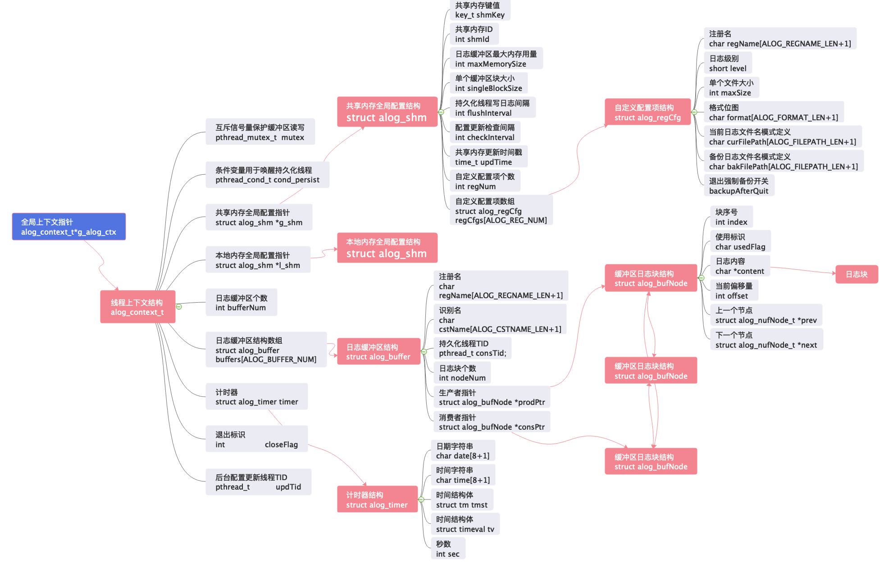
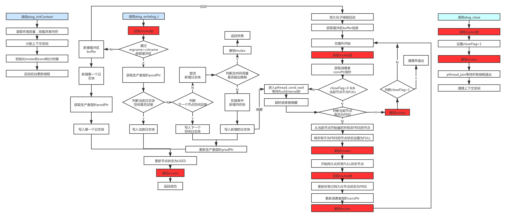

# Quick Reference

[TOC]

## What is ALOG

ALOG is a **Light , Thread safe , Asynchronized and Functional** log module for C.

## Configuration

### Global settings

${ALOG_HOME}/env/alog.env

```shell
# ALOG HOME Directory , mandatory
export ALOG_HOME=~/development/alog
# ALOG share memory key , mandatory
export ALOG_SHMKEY=1234
# add alogcmd to $PATH
export PATH=${PATH}:${ALOG_HOME}/bin
# single block size for persist thread to write , unit is KB
# Optional , default value is 4KB
export ALOG_SINGLEBLOCKSIZE=2
# maximum memory use for a single buffer , unit is Mb
# optional , defalut value is 4MB
export ALOG_MAXMEMORYSIZE=8
# flush interval for persist thread , unit is second
# optional , default value is 2 seconds
export ALOG_FLUSHINTERVAL=1
# update check interval for background update thread , unit is second
# optional , default value is 1 second
export ALOG_CHECKINTERVAL=1
```

### Log settings

${ALOG_HOME}/cfg/alog.cfg

```shell
# ALOG config file
# 1. regname
#    max 20 bytes
# 2. loglevel
#    LOGNON LOGFAT LOGERR LOGWAN LOGINF LOGADT LOGDBG
# 3. file size limit
#    single file size limit(MB)
# 4. prefix pattern
#    7 columns in total , defination as follows:
#    col1: date(YYYYMMDD)
#    col2: time(HH:MM:SS)
#    col3: micro seconds (1/10^6 s) 
#    col4: pid + tid
#    col5: modname
#    col6: log level
#    col7: filename+lineno
# 5. current filepath pattern
#    ${} : environment variabale
#    %R  : regname
#    %C  ：cstname
#    %Y  ：yead(YYYY)
#    %M  ：month(MM)
#    %D  ：date(DD)
#    %h  ：hour(hh)
#    %m  ：minute(mm)
#    %s  ：second(ss)
#    %P  ：PID
# 6. backup filepath pattern
# 7. forcebackup
#    set to 1 if you want to force backup after process quit
[TEST0][LOGINF][1][0111111][${ALOG_HOME}/log/%R.%C.log][${ALOG_HOME}/log/%R.%C.log.%Y%M%D%h%m%s][1]
```

## Compiling

```shell
# for release version
cd ${ALOG_HOME}/src & make clean all
# for debug version
cd ${ALOG_HOME}/src & make clean debug all
```


## Usage


1. include "alog.h" in your source file
2. call `alog_initContext` before anything else
3. call `alog_write_t` to write whatever you want
4. call `alog_close` before process quit
5. add `-I ${ALOG_HOME}/include` when compiling
6. add `-L ${ALOG_HOME}/lib -lalog` when linking

## Running


1. call `. alog.env` to load environment
2. use `alogcmd init` to initialize share memory
3. use `alogcmd reload` to refresh environments and logging configs
4. use `alogcmd print` to show configs
5. use `alogcmd close` to destroy share memory

## Data Structure



## Thread Logic


